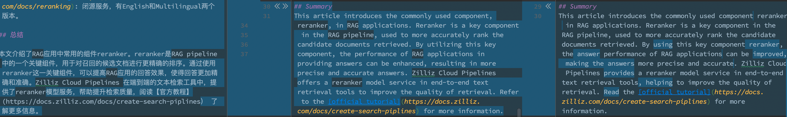

# GPTTranslator

支持中英文markdown文件的翻译、润色。

## Installation
```shell
# 创建一个虚拟环境并激活（可选）
python -m venv .gpt_trans_env && source .gpt_trans_env/bin/activate

# 安装gpt_trans
pip install gpt_trans
```

## Requirements
准备好OpenAI的API Key，并将其添加到环境变量中。
目前支持以下几个LLM模型：
- OpenAI gpt-3.5 和 gpt-4o-mini 等， 请配置环境变量 `OPENAI_API_KEY`
- Azure OpenAI GPT3.5 请配置环境变量 `AZURE_OPENAI_API_KEY`, `AZURE_OPENAI_ENDPOINT`, `AZURE_DEPLOYMENT`, `OPENAI_API_VERSION`

## Quickstart
- 翻译中文的md为英文的md，并润色。
```shell
gpt_trans path_to_your_md.md
```
默认会在`path_to_your_md`同级目录下生成`path_to_your_md_zh_to_en.md`结果文件和一个未润色的中间文件`path_to_your_md_zh_to_en_raw.md`。

然后可以用对比工具比较翻译前后和润色前后的差异，再手动修改润色后的结果。


- 效果可参考本Readme的英文翻译版本：[English README](README_zh_to_en.md)，它的命令如下：
```shell
gpt_trans ./README.md
```

## Usage
- 智能翻译，自动判断是中文还是英文进行翻译。
```shell
gpt_trans path_to_your_md.md
```


## 模型选择
使用llm参数可以选择模型，默认为OpenAI gpt-4o-mini。
比如要切换成gpt4：
```shell
gpt_trans path_to_your_md.md --llm gpt-4o-mini
```

## 参数说明
```shell
gpt_trans --help
```
```text
usage: gpt_trans [-h] [--mode {ModeType.SMART,ModeType.REFINE_ZH,ModeType.REFINE_EN,ModeType.ZH_TO_EN,ModeType.EN_TO_ZH}]
                 [--llm {LLMType.GPT3_5,LLMType.GPT4,LLMType.O1,LLMType.AZURE_GPT3_5,LLMType.GROQ_LLAMA3,LLMType.MOONSHOT}]
                 input_file

Translate using GPT Translator

positional arguments:
  input_file            The input file to be translated or be refined

optional arguments:
  -h, --help            show this help message and exit
  --mode {ModeType.SMART,ModeType.REFINE_ZH,ModeType.REFINE_EN,ModeType.ZH_TO_EN,ModeType.EN_TO_ZH}
                        Translation mode, should be one of [<ModeType.SMART: 'smart'>, <ModeType.REFINE_ZH: 'refine_zh'>, <ModeType.REFINE_EN: 'refine_en'>, <ModeType.ZH_TO_EN: 'zh_to_en'>,
                        <ModeType.EN_TO_ZH: 'en_to_zh'>]
  --llm {LLMType.GPT3_5,LLMType.GPT4,LLMType.O1,LLMType.AZURE_GPT3_5,LLMType.GROQ_LLAMA3,LLMType.MOONSHOT}
                        Language model to be used for translation, should be one of [<LLMType.GPT3_5: 'gpt-3.5-turbo'>, <LLMType.GPT4: 'gpt-4o-mini'>, <LLMType.O1: 'o1-mini'>, <LLMType.AZURE_GPT3_5:
                        'azure_gpt3.5'>, <LLMType.GROQ_LLAMA3: 'groq_llama3'>, <LLMType.MOONSHOT: 'moonshot'>]

```

```diff
  from gpt_trans import ModeType, LLMType
- test_0()
+ test_1()
```
